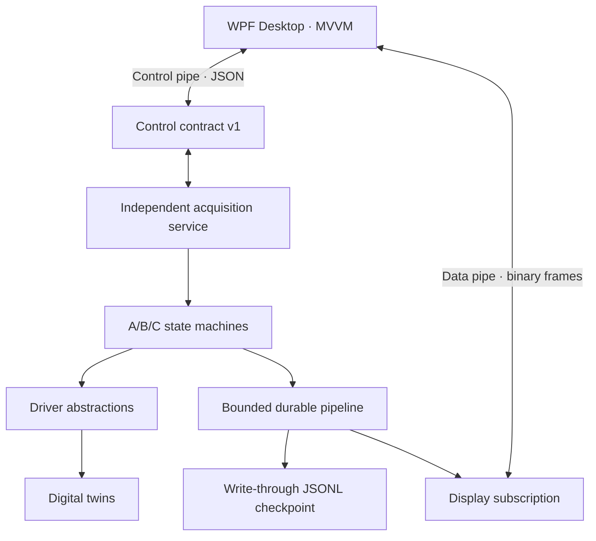

# Phase-one architecture

The persistence consumer is upstream of display publication. If the display is
slow, its bounded subscription drops old display frames; the input pipeline
uses `BoundedChannelFullMode.Wait`, so raw measurements are never silently
dropped. The JSONL store is an interim recovery boundary, not the final session
database.

The 3458A, 8508A, and SCPI families are represented by different
`InstrumentProtocol` values. Phase one only instantiates digital twins.
Subsequent live providers must pass transcript tests before the factory accepts
non-simulated resources.
