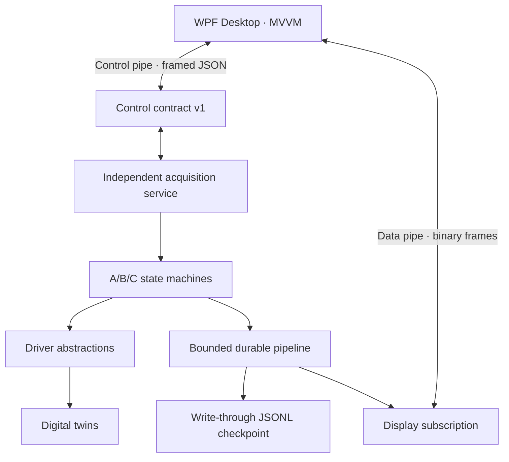

# Phase-one architecture

The service owns drivers, acquisition state, sequence generation, timing and
persistence. WPF never opens VISA/GPIB and never owns the raw measurement
lifecycle.

The persistence consumer is upstream of display publication. Each phase-one
measurement is written and explicitly flushed to disk before display
publication. If the display is slow, its bounded subscription drops old
display frames; the input pipeline uses `BoundedChannelFullMode.Wait`, so raw
measurements are never silently dropped. The JSONL store is an interim recovery
boundary, not the final SQLite/WAL session database.

The control stream uses a four-byte length prefix and a one-megabyte limit
instead of recreating buffered text readers for every command. This prevents a
reader from consuming bytes belonging to a later command.

The 3458A, 8508A, 8588A and profile-SCPI families have distinct
`InstrumentProtocol` values. Phase one only instantiates digital twins.
Subsequent live providers must pass transcript and real-instrument tests before
the factory accepts non-`SIM::` resources.
