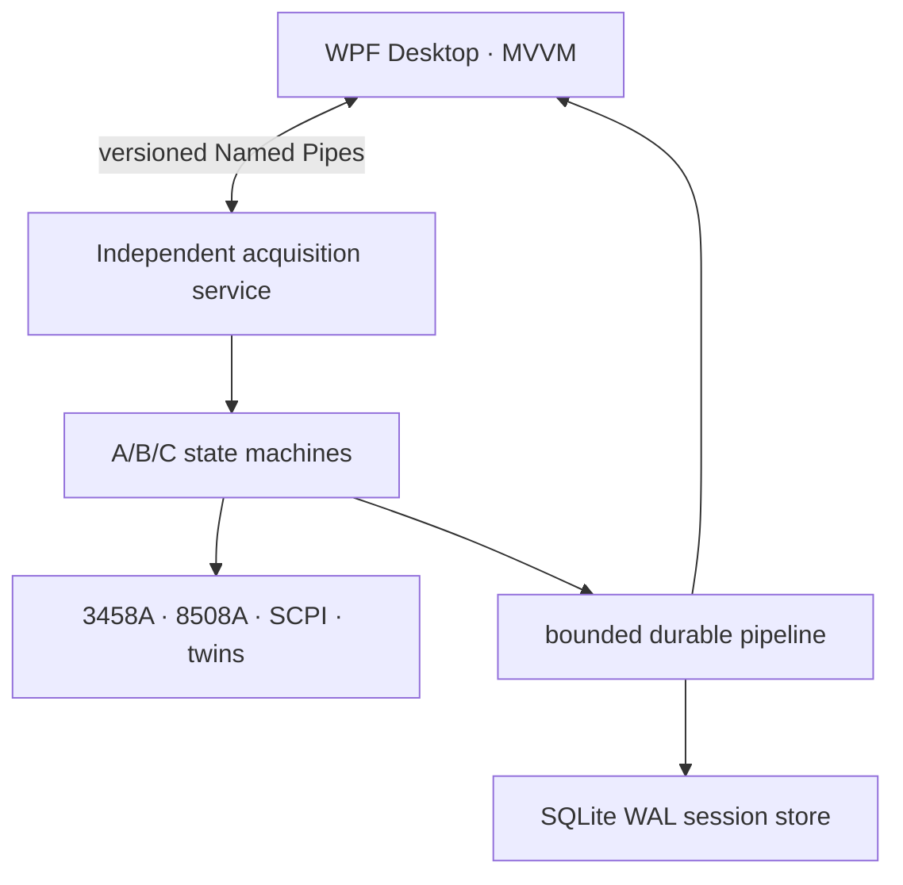

# PrecisionLab .NET architecture

The service exclusively owns VISA sessions, bus arbitration, acquisition
timing, raw sample sequence numbers and persistence. The WPF process only sends
versioned commands and receives display frames. Closing or crashing WPF
therefore does not close an active instrument session.

## Reliability boundary

Every regular sample follows this order:

1. the driver returns a typed measurement;
2. the bounded channel accepts it with wait backpressure;
3. SQLite inserts it and advances the contiguous committed sequence in one WAL
   transaction;
4. only after commit succeeds is the sample published to display subscribers.

Display subscriptions use drop-oldest buffering and may skip obsolete screen
frames. The session database, analysis input and CSV export never derive their
truth from that lossy display stream.

The 3458A burst path persists a block before broadcasting it. `Maximum`
durability commits each point, `Balanced` commits up to 256 points, and
`Throughput` commits up to 1024 points. The UI reports committed points
separately from received points.

At service startup, any session left in `Running` state is marked
`Interrupted`; its committed samples remain queryable and exportable.

## Driver boundaries

- Keysight 3458A uses legacy HP-IB commands and a native memory-burst path.
- Fluke 8508A uses its IEEE-488 command language.
- Twelve newer instruments use model-specific SCPI profiles.
- `*IDN?` or the equivalent legacy identity query must match the selected
  model before configuration commands are accepted.
- One physical VISA address cannot be assigned to two active channels.
- One lock serializes access to each GPIB controller.
- `SIM::` resources use deterministic digital twins and require no VISA
  runtime.

`IviFoundation.Visa` is only the vendor-neutral API. A physical run still needs
one vendor VISA 7.4+ implementation installed on Windows.

## Analysis and exchange

Pure C# analysis modules implement descriptive statistics, RMS, median,
peak-to-peak, noise ppm, linear drift, rolling mean, robust sigma filtering,
Hann FFT amplitude, Welch ASD, overlapping Allan deviation and min/max envelope
downsampling. CSV is an exchange format; SQLite remains the recovery format.
Diagnostic ZIP files intentionally exclude raw samples.
